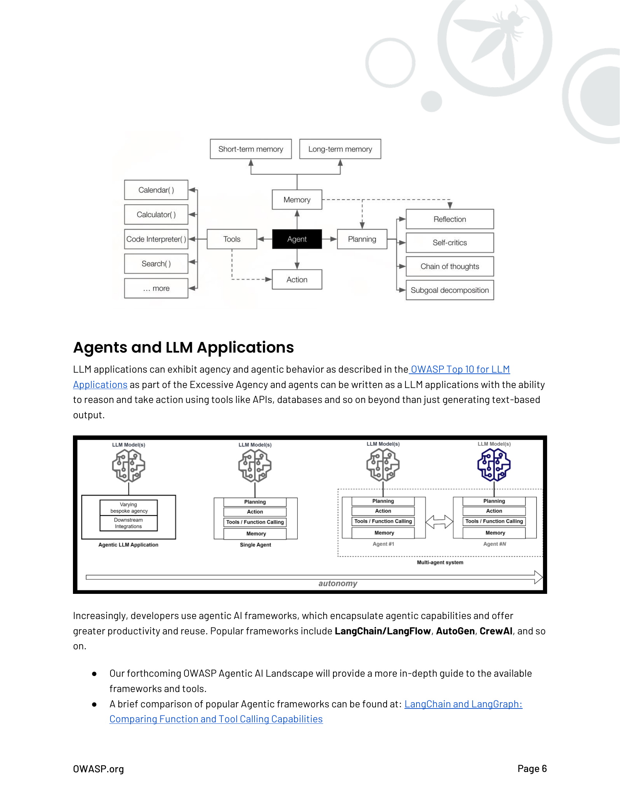

# Agentes de IA

Un agente es un sistema de software inteligente diseñado para percibir su entorno, razonar sobre él, tomar decisiones y realizar acciones para lograr objetivos específicos de manera autónoma. Más específicamente, Russell y Norvig definen los agentes en su clásico "Artificial Intelligence: A Modern Approach" de la siguiente manera:

> "Un agente inteligente es 'un agente que actúa apropiadamente para sus circunstancias y objetivos, es flexible ante entornos y objetivos cambiantes, aprende de la experiencia y toma decisiones apropiadas dadas sus limitaciones perceptuales y computacionales.'" (Artificial Intelligence: A Modern Approach, 4ta ed., p. 34)

Los Agentes de IA utilizan Machine Learning (ML) para el razonamiento; los enfoques tradicionales de ML (como Reinforcement Learning) juegan un papel clave en cada desarrollo. El Open AI Gym (ahora Gymnasium de Farama Foundation), ayudó a impulsar la primera ola de IA Agéntica. Sin embargo, las capacidades avanzadas, la interfaz de NLP y la escala de los LLMs han revolucionado la IA agéntica y acelerado su adopción.

Proveedores y empresas reconocidas están adoptando agentes LLM, y Gartner pronostica que para 2028 el 33% de las aplicaciones de software empresarial utilizarán IA agéntica "permitiendo que el 15% de las decisiones laborales del día a día se tomen de manera autónoma".

## Capacidades Principales

Hay muchas formas de describir un agente, pero típicamente, un agente o sistema de IA agéntica exhibirá los siguientes elementos:

### Planificación y Razonamiento

Los agentes pueden razonar y decidir sobre los pasos necesarios para lograr sus objetivos. Esto incluye formular, rastrear y actualizar sus planes de acción para manejar tareas complejas (el patrón Reason + Act, ReAct). Los agentes modernos utilizan LLMs como sus motores de razonamiento, con agentes usando el LLM para decidir el flujo de control de la aplicación. Este es un aspecto fundamental de la autonomía agéntica. El uso de reinforcement en esta nueva generación de agentes aún juega un papel, pero como un mecanismo para mejorar el entrenamiento y razonamiento, no el razonamiento central. Esto se describe en "OpenAI Computer-User Agent research preview, a state-of-the-art agent performing interactive web tasks for users". Ver https://openai.com/index/operator-system-card/

Los avances en LLMs han permitido estrategias sofisticadas de razonamiento y planificación tales como:

- **Reflexión**: donde el agente evalúa acciones pasadas y sus resultados para determinar planes o comportamientos futuros. **Autocrítica** es un componente clave de la reflexión, donde el agente critica su propio razonamiento o salida para identificar y corregir errores.

- **Cadena de Pensamiento**: es un proceso de razonamiento paso a paso en el cual el agente descompone problemas complejos en pasos secuenciales y lógicos. Esto puede involucrar flujos de trabajo de múltiples pasos, incluyendo aquellos sin interacción humana.

- **Descomposición de Subobjetivos**: que involucra dividir un objetivo principal en tareas o hitos más pequeños y manejables para lograr el objetivo general.

### Memoria / Estado

Para retener y recordar información. Esta es información de ejecuciones previas o los pasos previos que tomó en la ejecución actual (es decir, el razonamiento detrás de sus acciones, herramientas que llamó, la información que recuperó, etc.). La memoria puede ser memoria a corto plazo basada en sesión o memoria persistente a largo plazo.

### Acción y Uso de Herramientas

Los agentes pueden tomar acción para cumplir tareas e invocar herramientas como parte de las acciones. Estas pueden ser herramientas y funciones integradas como navegar por la web, realizar cálculos matemáticos complejos y generar o ejecutar código ejecutable en respuesta a una consulta del usuario. Los agentes pueden acceder a herramientas más avanzadas a través de llamadas API externas y una interfaz de Herramientas dedicada. Estas se complementan con LLMs aumentados, que ofrecen la invocación de herramientas desde código generado por el modelo a través de function calling, una forma especializada de uso de herramientas.

Para más información sobre function calling de LLM, ver:
- https://platform.openai.com/docs/guides/function-calling
- https://huggingface.co/docs/hugs/en/guides/function-calling
- https://python.langchain.com/v0.1/docs/modules/model_io/chat/function_calling/
- https://medium.com/@rushing_andrei/function-calling-with-open-source-llms-594aa5b3a304

La investigadora de OpenAI Lilian Wang ha descrito estas capacidades en estos diagramas populares republicados de su blog seminal de 2023 sobre Agentes basados en LLM.

## Agentes y Aplicaciones LLM

Las aplicaciones LLM pueden exhibir agencia y comportamiento agéntico como se describe en el OWASP Top 10 para Aplicaciones LLM como parte de la Agencia Excesiva y los agentes pueden escribirse como aplicaciones LLM con la capacidad de razonar y tomar acción usando herramientas como APIs, bases de datos y demás más allá de solo generar salida basada en texto.

Cada vez más, los desarrolladores utilizan frameworks de IA agéntica, que encapsulan capacidades agénticas y ofrecen mayor productividad y reutilización. Los frameworks populares incluyen **LangChain/LangFlow**, **AutoGen**, **CrewAI**, y otros.

- Nuestro próximo OWASP Agentic AI Landscape proporcionará una guía más profunda sobre los frameworks y herramientas disponibles.
- Una breve comparación de frameworks Agénticos populares se puede encontrar en: LangChain and LangGraph: Comparing Function and Tool Calling Capabilities

Puede encontrar ejemplos de agentes LLM escritos usando estos frameworks populares en nuestro repositorio GitHub de OWASP ASI en https://github.com/OWASP/www-project-top-10-for-large-language-model-applications/tree/main/initiatives/agent_security_initiative. Estos son agentes intencionalmente vulnerables para demostrar vulnerabilidades pero también pueden demostrar cómo funcionan los agentes.

La autonomía y agencia también pueden variar dependiendo del estilo de orquestación en el agente, desde codificado hasta restringido a través de código o flujos de trabajo de máquina de estados finitos (LangFlow) y completamente conversacional, donde las decisiones dependen puramente de interacciones y razonamiento del modelo.

