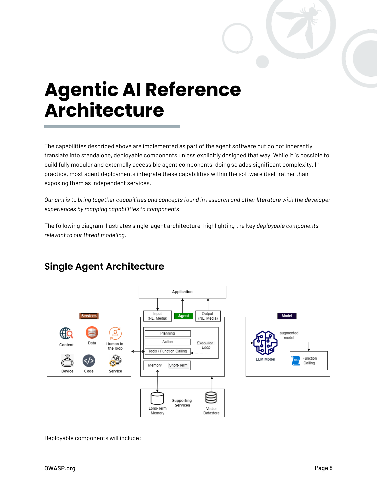

# Arquitectura de Referencia de IA Agéntica

Las capacidades descritas anteriormente se implementan como parte del software del agente pero no se traducen inherentemente en componentes independientes y desplegables a menos que se diseñen explícitamente de esa manera. Aunque es posible construir componentes de agente completamente modulares y accesibles externamente, hacerlo agrega complejidad significativa. En la práctica, la mayoría de los despliegues de agentes integran estas capacidades dentro del software mismo en lugar de exponerlas como servicios independientes.

Nuestro objetivo es reunir capacidades y conceptos encontrados en investigación y otra literatura con las experiencias de desarrolladores mapeando capacidades a componentes.

El siguiente diagrama ilustra la arquitectura de agente único, destacando los componentes desplegables clave relevantes para nuestro modelado de amenazas.

## Arquitectura de Agente Único

Los componentes desplegables incluirán:

1. **Una aplicación** que tiene funcionalidad agéntica embebida para realizar tareas para el usuario en nombre del usuario, a menudo fuera de una sesión de usuario específica.

2. **Un agente** generalmente acepta entrada en lenguaje natural similar a las entradas utilizadas para modelos NLP. Estas serán prompts textuales y medios opcionales como archivos, imágenes, sonido o video. El código de la aplicación implementa las capacidades principales y muy probablemente se basa en abstracciones ofrecidas por un framework agéntico (LangChain/LangFlow, AutoGen, Crew.AI, etc.).

3. **Uno o más modelos LLM** (locales o remotos) se utilizan para razonamiento.

4. **Servicios**, incluyendo funciones integradas, herramientas locales y código de aplicación local, servicios locales o remotos y externos, serán llamados de dos maneras posibles:
   a. Function calling e interfaz de Herramientas opcional a nivel de framework/aplicación
   b. Function calling por un modelo LLM devolviendo código de invocación al agente.

5. **Servicios de soporte**, parte de la infraestructura del agente y funcionalidad principal:
   a. **Almacenamiento Externo** para memoria persistente a largo plazo
   b. **Otras fuentes de datos** incluyen una base de datos Vector, otros datos y contenido utilizado en RAG. Las fuentes relacionadas con RAG también pueden verse como parte de las herramientas, pero las destacamos aquí como un servicio de soporte principal que puede utilizarse en cualquier aplicación LLM.

## Arquitectura Multi-agente

Una arquitectura multi-agente comprende múltiples agentes que pueden escalar o combinar roles especializados y funcionalidad en una solución agéntica. En ambos casos, la arquitectura es similar excepto por la introducción de comunicación inter-agente y, opcionalmente, un agente coordinador. Ver por ejemplo el uso de un agente supervisor coordinador en una arquitectura multi-agente usando Amazon Bedrock:
https://aws.amazon.com/blogs/aws/introducing-multi-agent-collaboration-capability-for-amazon-bedrock/

Dependiendo de la solución, diferentes agentes especialistas pueden introducirse con capacidades adicionales, como las principales que hemos definido. El siguiente diagrama ilustra un ejemplo de arquitectura multi-agente con roles especializados adicionales y capacidades:

El diagrama representa un ejemplo de arquitectura multi-agente de funcionalidad de agente especializada. La funcionalidad especializada es una forma de patrones agénticos y podría ser exhibida por cualquier agente dependiendo del caso de uso.

## Patrones de IA Agéntica

Los roles especializados y estrategias de planificación contribuyen a patrones agénticos. Estos patrones están emergiendo como bloques de construcción que pueden combinarse en un solo agente; pueden ayudarnos a entender arquitecturas a gran escala y ayudar en conversaciones eficientes de modelado de amenazas con lenguaje consistente. Un tratamiento detallado de patrones agénticos está más allá del alcance del trabajo de ASI, pero proporcionamos lo siguiente para ayudar a estandarizar conversaciones en modelado de amenazas.

| Patrón | Descripción |
|--------|-------------|
| **Agente Reflexivo** | Agentes que evalúan y critican iterativamente sus propias salidas para mejorar el rendimiento. Ejemplo: Generadores de código de IA que revisan y depuran sus propias salidas, como Codex con auto-evaluación. |
| **Agente Orientado a Tareas** | Agentes diseñados para manejar tareas específicas con objetivos claros. Ejemplo: Agentes automatizados de servicio al cliente para programación de citas o procesamiento de devoluciones. |

