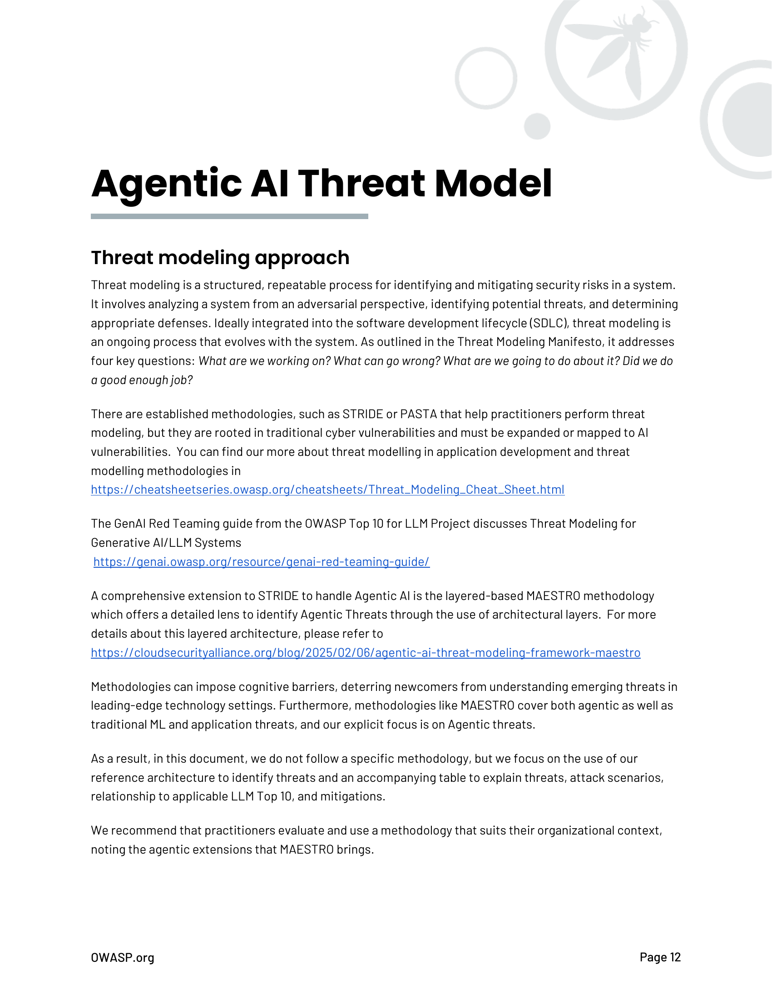

# Modelo de Amenazas de IA Agéntica

*[Esta sección contiene el modelo de amenazas detallado de IA Agéntica. El contenido completo se extraerá del PDF original y se traducirá en versiones futuras.]*

## Introducción al Modelado de Amenazas

El modelado de amenazas para sistemas de IA Agéntica requiere consideraciones especiales debido a la naturaleza autónoma y las capacidades extendidas de estos sistemas.

## Componentes del Modelo de Amenazas

### Activos
- Modelos LLM
- Datos de entrenamiento
- Memoria del agente
- Herramientas y APIs
- Infraestructura de soporte

### Amenazas Principales
- Manipulación de prompts
- Envenenamiento de datos
- Escalación de privilegios
- Fuga de información
- Ataques de adversarios

### Vectores de Ataque
- Entrada maliciosa
- Manipulación de herramientas
- Compromiso de memoria
- Ataques a la cadena de suministro

*Nota: Esta sección será expandida con el contenido completo del documento original.*

