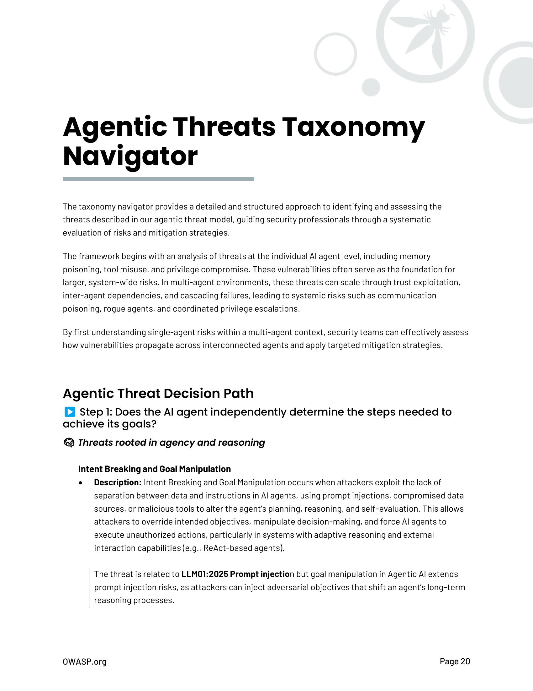

# Navegador de Taxonomía de Amenazas Agénticas

*[Esta sección contiene la taxonomía detallada de amenazas agénticas. El contenido completo se extraerá del PDF original y se traducirá en versiones futuras.]*

## Introducción

La taxonomía de amenazas agénticas proporciona una clasificación estructurada de las amenazas específicas que enfrentan los sistemas de IA agéntica.

## Categorías de Amenazas

### Amenazas de Entrada
- Inyección de prompts
- Manipulación de contexto
- Ataques de jailbreaking

### Amenazas de Procesamiento
- Manipulación de razonamiento
- Corrupción de memoria
- Interferencia en planificación

### Amenazas de Salida
- Fuga de información sensible
- Generación de contenido malicioso
- Acciones no autorizadas

### Amenazas de Infraestructura
- Compromiso de APIs
- Ataques a bases de datos
- Manipulación de herramientas

*Nota: Esta sección será expandida con el contenido completo del documento original.*

