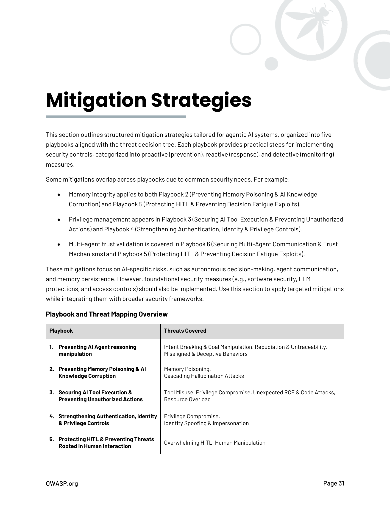

# Estrategias de Mitigación

*[Esta sección contiene las estrategias detalladas de mitigación para amenazas de IA agéntica. El contenido completo se extraerá del PDF original y se traducirá en versiones futuras.]*

## Introducción

Las estrategias de mitigación para sistemas de IA agéntica deben abordar tanto las amenazas tradicionales de seguridad como las específicas de estos sistemas autónomos.

## Categorías de Mitigación

### Controles de Entrada
- Validación de prompts
- Filtrado de contenido
- Sanitización de datos

### Controles de Procesamiento
- Monitoreo de razonamiento
- Límites de autonomía
- Validación de decisiones

### Controles de Salida
- Revisión de acciones
- Filtrado de respuestas
- Logging y auditoría

### Controles de Infraestructura
- Seguridad de APIs
- Protección de datos
- Gestión de accesos

*Nota: Esta sección será expandida con el contenido completo del documento original.*

