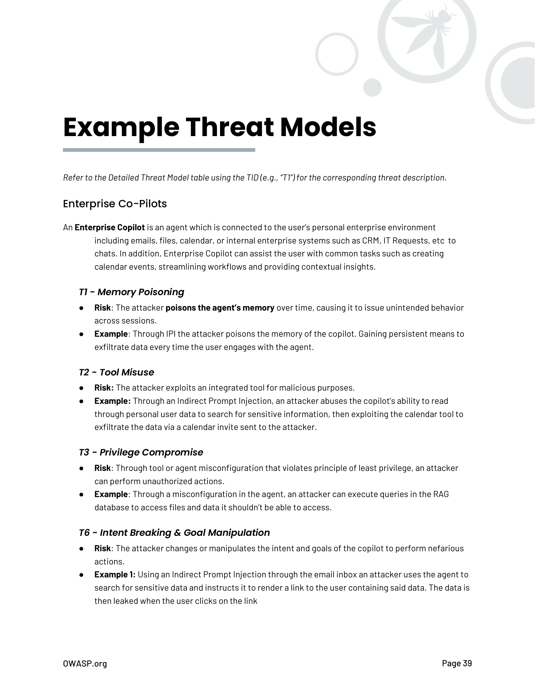

# Modelos de Amenazas de Ejemplo

*[Esta sección contiene ejemplos detallados de modelos de amenazas para diferentes escenarios de IA agéntica. El contenido completo se extraerá del PDF original y se traducirá en versiones futuras.]*

## Introducción

Esta sección presenta cuatro escenarios de ejemplo que ilustran cómo aplicar el modelado de amenazas a diferentes implementaciones de IA agéntica.

## Escenarios de Ejemplo

### Escenario 1: Asistente Personal Agéntico
- Descripción del sistema
- Amenazas identificadas
- Mitigaciones recomendadas

### Escenario 2: Agente de Servicio al Cliente
- Descripción del sistema
- Amenazas identificadas
- Mitigaciones recomendadas

### Escenario 3: Sistema Multi-agente Empresarial
- Descripción del sistema
- Amenazas identificadas
- Mitigaciones recomendadas

### Escenario 4: Agente de Análisis de Datos
- Descripción del sistema
- Amenazas identificadas
- Mitigaciones recomendadas

*Nota: Esta sección será expandida con el contenido completo del documento original.*

